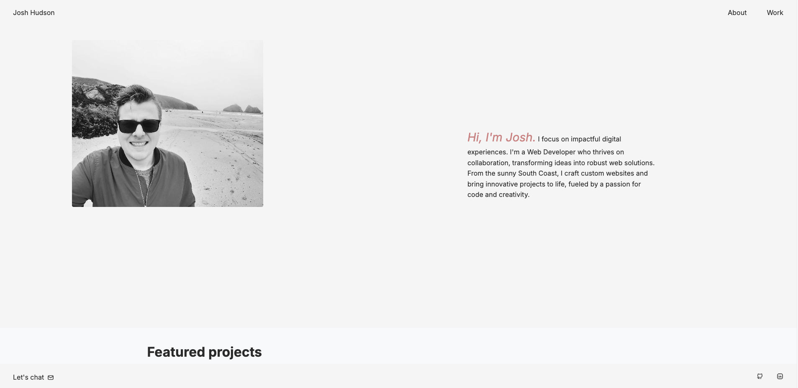

# Josh Hudson Portfolio



A modern, responsive portfolio website built with Nuxt.js 4 showcasing web development projects and skills. This site features smooth animations, an engaging loading screen, and seamless page transitions to create an exceptional user experience. Perfect for developers looking to showcase their work with style.

## ✨ What This Site Includes

This portfolio website demonstrates modern web development best practices and includes:

- **🎬 Animated Loading Screen**: Beautiful initial site load animation with floating elements and progress indicators
- **🔄 Page Transitions**: Smooth animations between pages using Vue Motion for enhanced UX
- **💼 Project Portfolio**: Dynamic showcase of featured projects with hover animations
- **📱 Responsive Design**: Mobile-first approach that works perfectly on all devices
- **🎨 Modern UI/UX**: Clean, professional design with thoughtful animations and interactions
- **⚡ Performance Optimized**: Built with Nuxt.js 4 for optimal loading speeds and SEO

## 🚀 Features

- **Modern Animation Stack**: Built with Nuxt.js 4, Vue.js 3, TypeScript, and Vue Motion
- **Interactive Loading Screen**: Engaging initial load experience with animated elements
- **Smooth Page Transitions**: Seamless navigation between pages with custom animations
- **Motion-First Design**: Every element is thoughtfully animated for better user engagement
- **Responsive Animations**: All animations respect user preferences (prefers-reduced-motion)
- **Project Showcase**: Dynamic project cards with stagger animations and hover effects
- **File-based Routing**: Automatic routing with dedicated pages for Home, About, and Work
- **Component Architecture**: Reusable animated components throughout the site
- **JSON Data Management**: Project data stored in structured JSON format with easy management
- **SCSS Styling**: Organized stylesheets with animation utilities and modern CSS practices
- **SEO Optimized**: Meta tags and structured data for better search visibility

## 🛠️ Technologies Used

### Core Framework

- **[Nuxt.js 4](https://nuxt.com/)**: The intuitive Vue framework for modern web applications
- **[Vue.js 3](https://vuejs.org/)**: Progressive JavaScript framework with Composition API
- **[TypeScript](https://www.typescriptlang.org/)**: Type-safe JavaScript for better development experience

### Animation & Motion

- **[@vueuse/motion](https://motion.vueuse.org/)**: Powerful animation library for Vue 3
- **[@vueuse/core](https://vueuse.org/)**: Collection of essential Vue composition utilities

### Styling & Design

- **SCSS**: Enhanced CSS with variables, mixins, and nested rules
- **CSS Grid & Flexbox**: Modern layout techniques for responsive design
- **Custom Animations**: Hand-crafted CSS animations and transitions

### Development Tools

- **[Vite](https://vitejs.dev/)**: Next-generation frontend tooling for fast development
- **[ESLint](https://eslint.org/)**: Code linting for consistent code quality
- **TypeScript Configuration**: Strict type checking and IntelliSense support

### Content & SEO

- **[@nuxt/content](https://content.nuxt.com/)**: File-based CMS for markdown content
- **[@nuxt/image](https://image.nuxt.com/)**: Optimized image handling and processing
- **Meta Tags**: Comprehensive SEO optimization

## 📚 Documentation

- **[Nuxt.js 4 Documentation](https://nuxt.com/docs)** - Complete guide to Nuxt.js features
- **[Vue Motion Documentation](https://motion.vueuse.org/)** - Animation library documentation
- **[Vue.js 3 Guide](https://vuejs.org/guide/)** - Vue.js fundamentals and advanced concepts

## 📦 Installation & Setup

### Prerequisites

- **Node.js** (v18 or higher) - [Download here](https://nodejs.org/)
- **npm** or **yarn** package manager
- **Git** for version control

### Quick Start

1. **Clone the repository**

   ```bash
   git clone https://github.com/joshyhud/josh-nuxt.git
   cd josh-nuxt
   ```

2. **Install dependencies**

   ```bash
   npm install
   # or
   yarn install
   ```

3. **Start development server**

   ```bash
   npm run dev
   # or
   yarn dev
   ```

4. **Open your browser**

   Navigate to `http://localhost:3000` (or the port shown in terminal)

   You'll see the animated loading screen followed by smooth page transitions!

### Development Notes

- The site includes an initial loading screen that displays for 3 seconds
- All animations respect user preferences for reduced motion
- Hot module replacement is enabled for instant development feedback
- TypeScript provides full type safety and IntelliSense support

## 🏗️ Build for Production

```bash
# Build the application
npm run build

# Preview the build
npm run preview

# Generate static files (if using SSG)
npm run generate
```

## 📁 Project Structure

```
josh-nuxt/
├── app/
│   ├── app.vue                    # Main app wrapper with loading screen
│   ├── components/
│   │   ├── LoadingScreen.vue      # Animated loading screen component
│   │   └── project-list.vue       # Recent projects with animations
│   ├── layouts/
│   │   └── default.vue            # Default layout with page transitions
│   ├── pages/
│   │   ├── index.vue              # Homepage with motion animations
│   │   ├── about.vue              # About page with staggered animations
│   │   └── work.vue               # Work portfolio with transitions
│   ├── plugins/
│   │   └── motion.client.ts       # Vue Motion plugin registration
│   └── assets/
│       └── scss/
│           ├── main.scss          # Main stylesheet imports
│           └── components/
│               └── animations.scss # Animation utilities and keyframes
├── components/
│   ├── Header.vue                 # Navigation with enter animations
│   ├── Footer.vue                 # Site footer
│   └── ProjectCard.vue            # Animated project cards
├── data/
│   └── projects.json              # Project data structure
├── public/
│   └── img/                       # Static images and assets
├── nuxt.config.ts                 # Nuxt configuration with motion module
├── package.json                   # Dependencies including animation libraries
└── README.md                      # This documentation
```

## 🎨 Customization

### Adding New Projects

Edit `data/projects.json` to add new projects with featured status:

```json
{
  "id": 7,
  "title": "Your Animated Project",
  "description": "Project description with engaging copy...",
  "image": "/img/your-project.png",
  "technologies": ["Nuxt.js", "Vue Motion", "TypeScript"],
  "liveUrl": "https://your-project.com",
  "githubUrl": "https://github.com/username/repo",
  "featured": true,
  "createdAt": "2025-07-30",
  "category": "Web Development"
}
```

### Customizing Animations

**Loading Screen**: Edit `app/components/LoadingScreen.vue`

- Modify animation duration, easing, and styling
- Change the loading time (currently 3 seconds)
- Customize colors and branding

**Page Transitions**: Update `app/app.vue`

- Adjust transition timing and effects
- Modify CSS transition properties

**Component Animations**: Each component uses `v-motion` directives

- Customize `initial`, `enter`, and `visible-once` states
- Adjust timing, delays, and easing functions

### Updating Content

- **Homepage**: Edit `app/pages/index.vue` - Includes hero animations
- **About Page**: Edit `app/pages/about.vue` - Features staggered text animations
- **Work Page**: Edit `app/pages/work.vue` - Portfolio with motion effects
- **Navigation**: Update `components/Header.vue` - Animated navigation items
- **Styling**: Modify files in `app/assets/scss/` - Includes animation utilities

### Animation Configuration

The site uses `@vueuse/motion` for animations. Key features:

- **Respects user preferences**: Automatically disables animations if user prefers reduced motion
- **Performance optimized**: Uses CSS transforms and opacity for smooth 60fps animations
- **Customizable**: Easy to modify timing, easing, and animation properties

### Adding Images

Place project images in `public/img/` directory and reference them in your JSON file as `/img/filename.png`

## 📋 Available Scripts

```bash
npm run dev          # Start development server with hot reload
npm run build        # Build for production
npm run preview      # Preview production build locally
npm run generate     # Generate static files for deployment
npm run postinstall  # Prepare Nuxt dependencies
```

## 🎬 Animation Features

This portfolio showcases modern web animation techniques:

### Loading Screen

- **Duration**: 3-second animated introduction
- **Elements**: Rotating loader, fade-in title, animated progress bar
- **Technology**: Vue Motion with custom CSS animations
- **Responsive**: Adapts to all screen sizes

### Page Transitions

- **Type**: Smooth fade and scale transitions between routes
- **Duration**: 600ms with cubic-bezier easing
- **Mode**: Out-in transitions prevent layout shift
- **Performance**: GPU-accelerated using CSS transforms

### Component Animations

- **Hero Section**: Staggered entrance animations for profile and text
- **Project Cards**: Hover effects and scroll-triggered animations
- **Navigation**: Subtle entrance animations on page load
- **Content**: Fade-up animations triggered by scroll position

### Accessibility

- **Reduced Motion**: Automatically respects `prefers-reduced-motion`
- **Performance**: 60fps animations using transform and opacity
- **Fallbacks**: Graceful degradation for older browsers

## 🚀 Deployment

### GitHub Pages (Recommended for Static Sites)

This portfolio can be deployed to GitHub Pages using GitHub Actions for automatic deployment.

#### Setup GitHub Pages Deployment

1. **Create GitHub Actions Workflow**

   Create `.github/workflows/deploy.yml` in your repository:

   ```yaml
   name: Deploy to GitHub Pages

   on:
     push:
       branches: [main]
     pull_request:
       branches: [main]

   jobs:
     build-and-deploy:
       runs-on: ubuntu-latest

       steps:
         - name: Checkout
           uses: actions/checkout@v4

         - name: Setup Node.js
           uses: actions/setup-node@v4
           with:
             node-version: "18"
             cache: "npm"

         - name: Install dependencies
           run: npm ci

         - name: Build application
           run: npm run generate

         - name: Deploy to GitHub Pages
           uses: peaceiris/actions-gh-pages@v3
           if: github.ref == 'refs/heads/main'
           with:
             github_token: ${{ secrets.GITHUB_TOKEN }}
             publish_dir: ./dist
   ```

2. **Configure Repository Settings**
   - Go to your repository → Settings → Pages
   - Select "Deploy from a branch"
   - Choose `gh-pages` branch as the source
   - Your site will be available at: `https://username.github.io/repository-name`

3. **Update Nuxt Configuration for GitHub Pages**

   Add to your `nuxt.config.ts`:

   ```typescript
   export default defineNuxtConfig({
     // ... existing config
     nitro: {
       prerender: {
         routes: ["/"],
       },
     },
     app: {
       baseURL:
         process.env.NODE_ENV === "production" ? "/your-repo-name/" : "/",
     },
   });
   ```

### Vercel (Alternative - Recommended for Full SSR)

1. Push your code to GitHub
2. Connect your repository to [Vercel](https://vercel.com)
3. Deploy automatically on every push
4. Custom domain support included

### Netlify

1. Build command: `npm run generate`
2. Publish directory: `dist`
3. Automatic deployments from Git

### Traditional Hosting

1. Run `npm run generate`
2. Upload the `dist` folder to your hosting provider
3. Configure server to serve the static files

## 🔧 Configuration

Key configuration files:

- `nuxt.config.ts` - Nuxt settings and modules
- `tsconfig.json` - TypeScript configuration
- `eslint.config.mjs` - Linting rules

## 📝 License

This project is open source and available under the [MIT License](LICENSE).

## 👤 Author

**Josh Hudson**

- Website: [your-portfolio.com](https://your-portfolio.com)
- GitHub: [@joshyhud](https://github.com/joshyhud)

## 🤝 Contributing

1. Fork the project
2. Create your feature branch (`git checkout -b feature/AmazingFeature`)
3. Commit your changes (`git commit -m 'Add some AmazingFeature'`)
4. Push to the branch (`git push origin feature/AmazingFeature`)
5. Open a Pull Request

---

⭐ Star this repo if you found it helpful!
